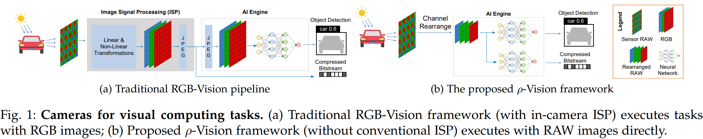

# [T-PAMI 2024] Efficient Visual Computing with Camera RAW Snapshots



We proposes a novel **$\bf{\rho}$-Vision** to directly perform **high-level semantic understanding** and **low-level compression** using **RAW images**. The framework is demonstrated to provide better detection accuracy and compression than RGB-domain counterparts and is shown to be able to generalize across different camera sensors and task-specific models. Additionally, it has the potential to **reduce ISP computation and processing time**.

In this repo, we release our **Unpaired CycleR2R** code and pretrained models. With Unpaired CycleR2R, you could **train your RAW model with diversity and realistic simulated RAW images** and then **deploy them in the real-world directly**.


## Requirments
```bash
pip install -r requirements.txt
```

## Datasets
(*required*) Download the [MulitRAW](https://box.nju.edu.cn/d/0f4b5206cf734bd889aa/).

(*optional*) Download the [BDD100K](https://www.bdd100k.com/).

(*optional*) Download the [Cityscapes](https://www.cityscapes-dataset.com/). 

(*optional*) Download the [Flicker2W](https://github.com/liujiaheng/CompressionData). 

The datasets folder will be like:
```bash
datasets
 ├─multiRAW
 │  ├─iphone_xsmax
 │  ├─huawei_p30pro
 │  ├─asi_294mcpro
 │  └─oneplus_5t
 ├─(optional) bdd100k
 ├─(optional) cityscapes
 └─(optional) flicker
```


## Pretrained Models
| Source RGB | Target RAW | Model | 
| :---: | :----: | :---: |
| BDD100K | iPhone XSmax | [link](https://box.nju.edu.cn/f/d1e199cd5ada49b88ad9/) |
| BDD100K | Huawei P30pro | [link](https://box.nju.edu.cn/f/9eddaab558ce4b1e953e/) |
| BDD100K | asi 294mcpro | [link](https://box.nju.edu.cn/f/c813bc63ddc14932aba3/) |
| BDD100K | Oneplus 5t | [link](https://box.nju.edu.cn/f/ac70a11515834c43a1ac/) |
| Cityscapes | iPhone XSmax | [link](https://box.nju.edu.cn/f/ec6fc364d90d482f9001/) |
| Flicker2W | iPhone XSmax | [link](https://box.nju.edu.cn/f/acbdf1dded594587aac7/) |
| Flicker2W | Huawei P30pro | [link](https://box.nju.edu.cn/f/647e979dc59d4f8c845c/) |
| Flicker2W | asi 294mcpro | [link](https://box.nju.edu.cn/f/c26c0e5a84da49f884b7/) |
| Flicker2W | Oneplus 5t | [link](https://box.nju.edu.cn/f/3a223fd40c3d4b548ca8/) |


## Training
```bash
python train.py configs/unpaired_cycler2r/unpaired_cycler2r_in_bdd100k_rgb2iphone_raw_20k.py
```

## Inference
Please download the [pretrained model](https://box.nju.edu.cn/f/d1e199cd5ada49b88ad9/) first.

You coud inference using command,
```bash
python inference.py --ckpt bdd100k_rgb_to_iphone_raw.pth --rgb resources/bdd100k.jpg
```

or in your code
```python
from inference import DemoModel
ckpt_path = 'bdd100k_rgb_to_iphone_raw.pth'
rgb_path = 'resources/bdd100k.jpg'

model = DemoModel(ckpt_path)
rgb = imread(rgb_path).astype(np.float32) / 255
rgb = torch.from_numpy(rgb).permute(2, 0, 1)[None]

model = model.cuda()
rgb = rgb.cuda()

raw = model(rgb, mosaic=False)
```


## Citation
If your find our dataset and work are helpful for your research, please cite our paper.
```
@article{li2022efficient, 
	title={Efficient Visual Computing with Camera RAW Snapshots},
	author={Zhihao Li, Ming Lu, Xu Zhang, Xin Feng, M. Salman Asif, and Zhan Ma},
	journal={arxiv}, 
	url={https://arxiv.org/pdf/2212.07778.pdf}, 
	year={2022}, 
}
```